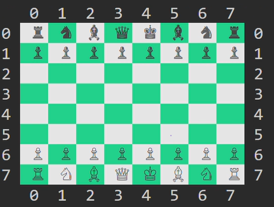
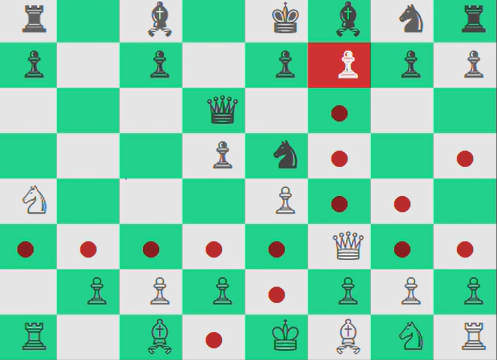

# CLI_Chess

---

## Table of Contents

- [Overview](#overview)
- [Features](#features)
- [Technical Structure](#technical-structure)
- [Setup](#setup)
- [How to Play](#how-to-play)
- [Game Examples](#game-examples)
	- [Normal Playing Session](#example-normal-playing-session-game-start)
	- [Queen's Multiple Moves](#example-queens-multiple-moves)
- [Testing](#testing)
- [Design Notes](#design-notes)
- [License](#license)


## Overview


Welcome to **CLI_Chess**—where classic strategy meets the raw power of the command line. This is not just another chess app. It's a hand-crafted, fully interactive chess experience for two players, built in Ruby, designed to bring the thrill of the game to your terminal. Every move, every check, every promotion is rendered in crisp color and Unicode, so you feel the tension of the board with every turn.

No AI. No shortcuts. Just you, your opponent, and the timeless battle of wits. The code is modular, clean, and ready for you to hack, extend, or just enjoy. Whether you're a chess enthusiast or a Ruby craftsman, this project is for you.


## Features

- All the rules of chess—no compromises. Legal moves, check, checkmate, stalemate, and pawn promotion.
- See your captured pieces and your opponent's losses at a glance.
- Danger zones and possible moves are highlighted right on the board. No guesswork.
- Two-player, face-to-face competition. Enter your names, pick your colors, and let the mind games begin.
- Beautiful Unicode chess pieces and colorized squares (with the `colorize` gem) make every move pop.
- Built for hackers: modular, object-oriented, and fully tested with RSpec.


## Technical Structure

- `main.rb`: Entry point for a full chess game session
- `lib/board.rb`: Board state, move logic, and game flow
- `lib/piece.rb` and subclasses: Piece-specific movement and symbol logic (King, Queen, Rook, Bishop, Knight, Pawn)
- `lib/players.rb`: Player data and color selection
- `spec/`: RSpec tests for board and move logic


## Setup

1. Make sure you have Ruby (2.7+ recommended).
2. Install the `colorize` gem for a vibrant board:
	```sh
	gem install colorize
	```
3. Clone this repo, `cd` into the folder, and fire it up:
	```sh
	ruby main.rb
	```


## How to Play

1. Start the game. Enter your name. Choose your color. Your rival does the same.
2. The board appears—classic, coordinate-labeled, and ready for battle.
3. On your turn, pick a piece by its X and Y coordinates (0-7). Then pick where you want it to go.
4. Illegal moves? The game won't let you. You're forced to play smart.
5. Check, checkmate, stalemate, and pawn promotion are all handled for you. No mercy, no mistakes.
6. The game ends with a winner—or a draw if neither of you can break through.


## Game Examples


### Example: Normal Playing Session (Game Start)


```
Creating player ONE!
Name: Alice
Available colors:
0.white
1.black
Your choice: 0
Creating player TWO!
Name: Bob
The remaining color is: ["black"]

	0  1  2  3  4  5  6  7
0 ♜ ♞ ♝ ♛ ♚ ♝ ♞ ♜ 0
1 ♟ ♟ ♟ ♟ ♟ ♟ ♟ ♟ 1
2   .   .   .   .   .   .   .   . 2
3   .   .   .   .   .   .   .   . 3
4   .   .   .   .   .   .   .   . 4
5   .   .   .   .   .   .   .   . 5
6 ♙ ♙ ♙ ♙ ♙ ♙ ♙ ♙ 6
7 ♖ ♘ ♗ ♕ ♔ ♗ ♘ ♖ 7
	0  1  2  3  4  5  6  7

Alice pick a white piece please
pick your X piece: 6
pick your Y piece: 4
Possible moves highlighted in red...
pick your X move: 4
pick your Y move: 4
... (game continues)
```

*Every move is a decision. Every mistake is punished. The board is your battlefield—own it.*


### Example: Queen's Multiple Moves

The queen is the most powerful piece on the board. She sweeps across ranks, files, and diagonals—no one is safe. Here’s what her reach looks like from the center:

```
	0  1  2  3  4  5  6  7
0   .   .   .   ●   .   .   .   .
1   .   .   ●   .   ●   .   .   .
2   .   ●   .   .   .   ●   .   .
3   ●   .   .   ♕   .   .   ●   .
4   .   ●   .   .   .   ●   .   .
5   .   .   ●   .   ●   .   .   .
6   .   .   .   ●   .   .   .   .
7
	0  1  2  3  4  5  6  7
```
*Legend: ♕ = Queen, ● = Possible move*




## Testing

Want to make sure everything works? Run the test suite:
```sh
rspec
```
All the logic—board, moves, check, mate, and more—is covered. Want to add your own rules or pieces? Fork it, write your tests, and go wild.


## Design Notes

- **Built for Tinkerers:** The code is clean, modular, and ready for you to break, extend, or improve. Want to add AI? Go for it. Want to log every move? Easy.
- **Terminal Artistry:** Unicode chess pieces and colorized backgrounds make every match a visual treat—even in a terminal.
- **Battle-Tested:** RSpec covers the core logic. If you break it, you’ll know.
- **Fast and Responsive:** No lag, no flicker. Just pure chess.
- **Limitations:** Two players, one terminal. No save/load yet. But the code is yours—make it what you want.

## Troubleshooting & Tips

- If you see weird symbols, check your terminal’s Unicode support.
- No color? Make sure you installed the `colorize` gem and your terminal supports ANSI colors.
- For the best look, use a dark or neutral terminal background.


## License

MIT License. Use it, share it, hack it. Just don’t claim you wrote it first.